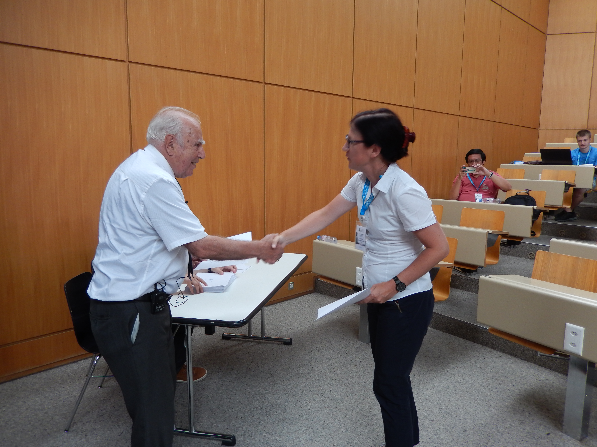

<h1>Guide to my actuarial odds and ends</h1>
<h3>
There was a time in my life when I was very keen on actuarial science. I was working as an actuarial specialist and 
was trying to catch some glimpses of actuarial theory and practice. As it was quite hard to achieve that in Poland, soon
I started to travel all around Europe to participate in trainings. Here I gathered their dates and titles: 
</h3>

<small>*I had been preparing very solid notes sometimes, maybe in future I will put them here, 
provided I go back to actuarial work.</small>

<small>**I put here also things that I had taken as 
<it>
Certified Auditor Candidate (Kandydat na Biegłego Rewidenta)
</it>
</small>

<ul>
<li>
11-12.III.2019
&nbsp;
Advanced Non-Life Pricing & Profitability: Machine Learning Techniques with R, Athens
</li>
<li>
26-29.IX.2018
&nbsp;
Actuarial Modelling with special consideration of Solvency II - course for Austrian Actuaries,
organized by Austrian Financial Market Authority (FMA) and Salzburg University,
Salzburg
</li>
<li>
13-17.VIII.2018
&nbsp;
Insurance Analytics, a Primer - 31st International Summer School of The Swiss Association of Actuaries,
Lausanne, Switzerland
 
Below you may find me and professor Hans Bühlmann (yes, THIS Bühlmann that you may know from 
<a href="https://en.wikipedia.org/wiki/B%C3%BChlmann_model">
Bühlmann model</a>) at the closing ceremony of the School.
 

  

</li>

<li>
8.IV-24.VIII.2018
&nbsp;
Accounting Theory and Principles - Training for Certified Auditor Candidates
</li>
<li>
4–7.IV.2018
&nbsp;
International Accounting of Insurance Companies - course for Austrian Actuaries,
organized by FMA and Salzburg University,
Salzburg
</li>
<li>
19–20.III.2018
&nbsp;
Non-Life Pricing: Introduction to practical implementation of modern techniques in R 
 - Training organized by European Actuarial Academy,
Athens
</li>
<li>
1.XII.2017
&nbsp; 
Professionalism - training organized by Polish Actuarial Society,
Warsaw
</li>
<li>
18–19.X.2017
&nbsp;
Understanding IFRS 17 - Training organized by European Actuarial Academy,
Lisbon
</li>
<li>
15.IX.2017
&nbsp;
IFRS 17 
(in a frame of 28. Warsaw Actuarial Summer School),
Warsaw
</li>
<li>
11–12.IX.2017
&nbsp;
Reinsurance and modelling natural disasters, 
with Excel exercises on reinsurance pricing
(in a frame of 28. Warsaw Actuarial Summer School),
Warsaw
</li>
<li>
7.IX.2017
&nbsp;
Economics and internal control - Passing the exam for Certified Auditor Candidates,
Warsaw
</li>
<li>
19.V–26.VI.2017
&nbsp;
Economics and internal control - Training for Certified Auditor Candidates,
Warsaw
</li>
<li>
19–22.IV.2017
&nbsp;
Risk Management In Insurance - course for Austrian Actuaries,
organized by FMA and Salzburg University,
Salzburg
</li>
<li>
II.2017–VI.2017
&nbsp;
Macroeconomics - remote training organized by Polish Actuarial Society,
completed with passing the exam, 
in Polish,
Warsaw
</li>
<li> 
12–13.IX.2016
&nbsp;
Internal models for life insurance companies in Europe - market approach and solutions
(in a frame of 27. Warsaw Actuarial Summer School),
in Polish,
Warsaw
</li>
<li>
8–9.IX.2016
&nbsp;
Claim Cost Estimation in General Insurance,
(in a frame of 27. Warsaw Actuarial Summer School),
Warsaw
</li>
<li>
<b style="color:red;">
X.2015–VI.2016
&nbsp;
Selected Actuarial Methods - approx. 112 hours long course organized by Polish Actuarial Society,
with exercises in R,
completed with passing the exam, 
in Polish,
Warsaw
</b>
</li>
<li>
13–14.XI.2015
&nbsp;
Solvency II Standard Formula Calibration Processes and Results 
(in a frame of 12th HAS Fall School of the Hungarian Actuarial Society), 
Visegrad, Hungary
</li>
<li>
23–24.IX.2015
&nbsp;
Reinsurance Mathematics 
(in a frame of 26. Warsaw Actuarial Summer School),
Warsaw
</li>
<li>
17–18.IX.2015
&nbsp; 
Accounting and reporting of insurance companies
(in a frame of 26. Warsaw Actuarial Summer School), completed with passing the exam, 
in Polish,
Warsaw
</li>
<li>
14–16.IX.2015 
&nbsp; 
Models and Statistics for Loss Distributions 
(in a frame of 26. Warsaw Actuarial Summer School), with exercises in R,
Warsaw
</li>
</ul>